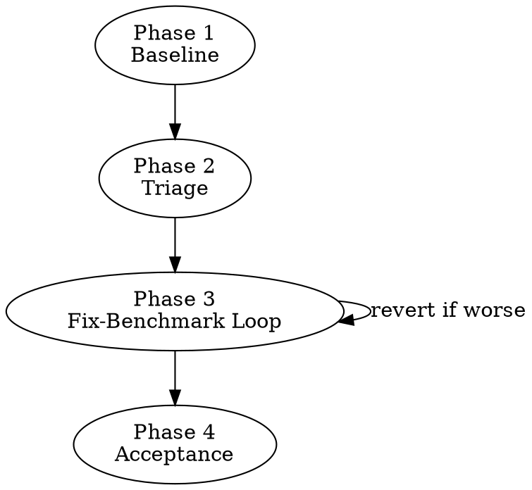

# Cross-Language Alignment

Iterative, benchmark-driven convergence of multi-language implementations toward a canonical source. Most divergences come from a small set of recurring patterns. Fix the input pipeline first.

## Four Guardrails

1. **Canonical source**: One implementation is ground truth. Ask the user which. Frame all divergences as "X differs from canonical," never "they differ from each other."
2. **Complexity ceiling**: Revert ANY fix that worsens more outputs than it improves. No convoluted special-case logic — if the fix isn't clean, the diagnosis is wrong.
3. **Shared config**: All parameters in a language-agnostic config file (JSON/YAML). Zero hardcoded constants across implementations.
4. **Document everything**: Log every fix attempt (including reverts) with root cause, before/after metrics, and files changed.

## Workflow

### Phase 1 — Baseline (yields 80-90% of alignment)

Align inputs BEFORE debugging algorithms:
- **Same gage/row population**: Identical filtering logic (per-year quality, min years, completeness thresholds)
- **Same water year / time ranges per item**: Per-year filtering, not just global filtering
- **Same output schema**: Column names, ordering, units
- **Shared config**: All thresholds from one JSON/YAML file

Run first comparison. If >50% of columns diverge, the problem is almost certainly here, not in algorithms.

### Phase 2 — Triage

For each divergent column, classify using the **Divergence Pattern Table** below. Sort by impact (number of affected columns). Fix highest-impact pattern first.

Use three-way comparison when 3+ implementations exist — it reveals which implementation is the outlier.

### Phase 3 — Fix-Benchmark Loop

**Iron rule: ONE fix at a time. Benchmark AFTER every fix. Revert if worse.**

1. Pick highest-impact pattern category
2. Implement fix in non-canonical implementation
3. Re-run full benchmark on complete population
4. Compare before/after metrics for ALL columns (not just the target)
5. If ANY column regresses significantly: revert immediately
6. Record: columns affected, pre/post metrics, root cause, files changed

### Phase 4 — Acceptance

Document irreducible divergences with root cause analysis. Declare threshold met. Typical irreducible sources: OLS library differences (QR vs SVD on near-singular matrices), floating-point ordering differences in associative operations.

## Divergence Pattern Table

| # | Pattern | Symptom | Fix Strategy |
|---|---------|---------|-------------|
| 1 | **NaN propagation** | Recursive filter cascades NaN to all subsequent values; `sum()` vs `sum(na.rm=TRUE)` | Forward-fill through NaN gaps; use paired masking (only sum where BOTH numerator and denominator are valid) |
| 2 | **Asymmetric filtering gate** | One impl has extra `min_days`, `Q > 0`, or `nrow < 3` check that canonical lacks | Remove gates not in canonical; let shared `generate_stats()` handle minimum-data logic |
| 3 | **Off-by-one indexing** | Rolling window assigned to position 15 vs 16; overlapping vs non-overlapping half-splits | Match canonical's exact index formula — don't reason about "correct"; match the reference |
| 4 | **Algorithm variant** | Different event identification (look-ahead vs local), exceedance formula (Weibull vs Hazen), rank method (tied vs ordinal) | Match canonical exactly; don't approximate or "improve" |
| 5 | **Library edge case** | R's `lm()` rejects near-singular matrices; Python's `linregress()` succeeds with extreme slopes | Add equivalent guard in non-canonical (e.g., `var(x) < 1e-10` → skip) |
| 6 | **Stat pre-filtering** | Stats computed on arrays containing NaN — different n values, different p-values | Pre-filter NaN from BOTH values AND their paired year indices before computing stats |
| 7 | **Scale/units mismatch** | Exceedance 0-100 vs 0-1; `ddof=0` vs `ddof=1`; cfs vs mm/day | Match canonical's scale and conventions exactly |
| 8 | **Tie-handling** | Interpolation at duplicate x-values: `last` vs `mean` vs arbitrary | Match canonical's tie-handling (e.g., R's `approx(ties=mean)`) |
| 9 | **Column naming** | `FDC_all` vs `FDCall` — columns silently excluded from comparison | Normalize during comparison; fix naming at source |

## Comparison Methodology

- **Primary metric**: Spearman rank correlation per column across all shared items. Rank-based is robust to scale differences.
- **Three axes**: (1) Summary rho per column, (2) NA pattern mismatches (extra NAs in one impl), (3) Per-item deep-dive on worst columns
- **Three-way comparison**: When 3+ implementations exist, compare all pairs. The outlier is immediately visible (e.g., R-Py=1.000, R-Jl=0.57 → Julia is wrong).
- **Track categories**: Group columns by signature type. If all recession columns diverge, the root cause is in recession code, not stats.

## Common Mistakes

- **Fixing at wrong level**: Debugging algorithm when the input filtering differs (Phase 1 vs Phase 3)
- **Pairwise-only comparison**: Masks which implementation actually diverges
- **Fixing multiple categories simultaneously**: Can't attribute improvement or regression
- **Language-specific "optimizations"**: Forward-fill vs interpolation vs compaction — match canonical, don't optimize
- **Ignoring NA pattern mismatches**: 15 extra NaN gages in one impl means a filtering gate difference, not an algorithm bug
- **Assuming NaN equals NaN**: `NaN != NaN` in most languages; excluded from correlation by default, hiding divergences

## Red Flags — STOP and Reconsider

| Thought | Reality |
|---------|---------|
| "Close enough at rho=0.98" | Is it close enough, or is there a clean bug hiding? Check the pattern table first. |
| "The canonical implementation is wrong here" | Maybe, but match it first, then propose a fix to canonical separately. Never diverge intentionally during alignment. |
| "This needs a special case for edge gages" | Special cases mask root causes. If 15 gages diverge, there's a systematic reason. |
| "I'll fix these 3 things together since they're related" | Fix ONE, benchmark, then decide. Related fixes can interact in unexpected ways. |
| "The theory says this fix should work" | Three reverted fixes in this project's history had sound theory but worsened benchmarks. The benchmark is the ground truth, not the theory. |

## Worked Example

**Problem**: Julia flashiness was 26x higher than R/Python for one gage (0.496 vs 0.019).

**Triage**: Pattern #1 (NaN propagation) + Pattern #4 (Algorithm variant).

**Root cause**: Julia removed NaN values and compacted the array before computing `diff()`, creating artificial jumps between non-adjacent days. R uses `approx()` (linear interpolation) to fill NaN gaps, preserving temporal adjacency.

**Fix**: Rewrote Julia's `calculate_flashiness()` to interpolate NaN values using linear interpolation (matching R's `approx()`). Added `na_frac > 0.2` guard matching R/Python.

**Benchmark**: Re-ran full comparison. Flashiness rho improved from outlier to >0.999. No other columns regressed. Fix kept.

**Lesson**: One pattern, one fix, one benchmark. The diagnosis pointed to NaN handling; the fix matched canonical's approach exactly.
